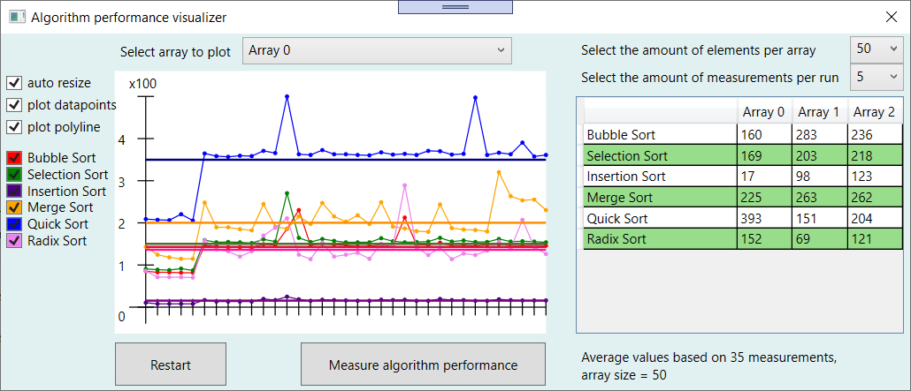

# AlgorithmCompare

## Synopsis

The goal of this project is to demonstrate the performance differences between certain algorithms.
Currently, it features 6 algorithms that can be used to sort the contents of an array:
Bubble Sort, Selection Sort, Insertion Sort, Merge Sort, Quick Sort and Radix Sort, as found on [this page](https://www.geeksforgeeks.org/sorting-algorithms/ "Geeksforgeeks sorting algorithms overview").

## Usage

To initialize the ArrayCompare class, execute the ArrayCompare.Init() function. 
Inside this function, the algorithms are selected that have to be tested. Algorithms can easily be added or removed from the List.
Currently, the comparison functionality is executed by executing the ArrayCompare.RunTestBench() function.
This function will execute all algorithms for all provided arrays and measure the elapsed time for every combination.



The screenshot above shows the current state of the application: the user can select which array data has to be plotted and can configure the amount of elements per array and the amount of measurements that's done every time the performance cycle is run. The Datatable on the right reflects the average amount of ticks it took to sort a certain array (column) with a certain algorithm (row). In the graph, the horizontal line also reflects the average calculation duration of the corresponding algorithm. The datapoints reflect the individual measurements, deselecting the "plot datapoints" and "plot polyline" checkboxes will hide these points.

## Code Example

The following example shows how the functions are implemented in the current project. It executes 5 measurements, shows the average results and then adds the results to the graph.

In MainWindow.xaml.cs:
```
// Run 5 measurements for every algorithm for every array
ArrayCompare.RunTestBench(5);

// Refresh the datatable called arrayData
arrayData.Items.Refresh();

// Get all measurements from every algorithm for array 1
List<double[]> algorithmPerformanceList = new List<double[]>();            
for(int i=0; i< ArrayCompare.algorithmNames.Count; i++)
{
	algorithmPerformanceList.Add(ArrayCompare.GetResultArrayDouble(i, 1));
}

// Add the retrieved results to the graph
graphData.AddAlgorithmsDataToGraph(algorithmPerformanceList);
```

## Motivation

In order to visualize the efficiency of multiple sorting algorithms, I decided to make this program.
First and foremost, this project exists because it seemed interesting to me to create it.

## Credits

This project is done solely by myself

## License

MIT License

